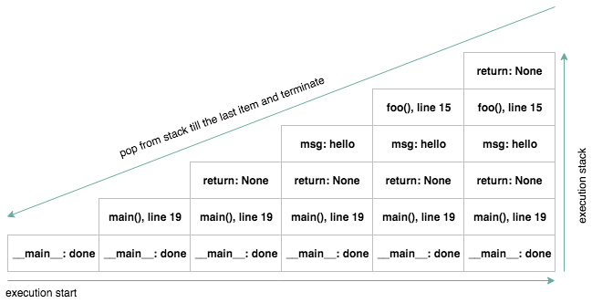
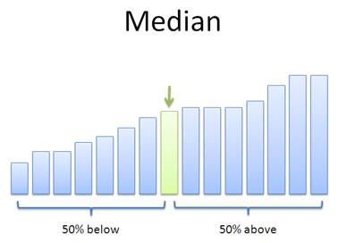

- [Что такое рекурсия?](#org55b91c4)
- [Правильная рекурсия](#orgb4e3df9)
- [Что такое стек вызовов?](#org8e94c94)
- [Что такое стек вызовов?](#orge1f170b)
- [Почему рекурсия это плохо](#org0db6163)
- [Recursion depth](#orgb363028)
- [Глубина рекурсии](#org71f075d)
- [Почему рекурсия это хорошо](#org95d5914)
- [Вариант задачи для рекурсии](#orgd682aa4)
- [Хвостовая рекурсия](#org738db69)
- [Оптимизация хвостовой рекурсии и почему её нет в Python](#org4f0457d)
- [Пример когда рекурсия помогает](#orgd2dd498)
- [Дополнительная литература](#orge3c941f)
- [Зачем нужна сортировка данных](#orgea157db)
- [Глупая сортировка / сортировка дурака](#orga2da1de)
- [Пузырьковая сортировка](#org5e17d9b)
- [Сортировка вставками](#orgec7b8bc)
- [Сортировка вставками](#org008f108)
- [Сортировка Шелла](#org0d01af7)
- [Быстрая сортировка](#org6a47b10)
- [Быстрая сортировка без рекурсии](#orgb54c291)
- [Сортировка слиянием (Merge Sort)](#orgef57667)
- [Сравнение алгоритмов сортировки](#org5788a84)
- [Устойчивость сортировки](#org13d2047)
- [Экзотические сортировки](#org155cf31)
- [Дополнительная литература](#orgbe4bd45)
- [Вопросы-ответы](#orgd47ef49)


<a id="org55b91c4"></a>

# Что такое рекурсия?

Приём в программировании, когда задача может быть разделена на несколько таких же, но проще, задач.  

```python
def pow(x, n):
    # возведение числа в степень это
    # умножение числа на число
    # в степени n-1
    if n == 0:
        return 1
    return x * pow(x, n-1)
```


<a id="orgb4e3df9"></a>

# Правильная рекурсия

```python
def pow(x, n):
    # хорошо бы проверить,
    # что база достижима
    assert n >= 0
    # base case / база рекурсии
    if n == 0:
        return 1
    # recursive case / шаг рекурсии
    return x * pow(x, n-1)
```


<a id="org8e94c94"></a>

# Что такое стек вызовов?

```python
def foo(msg):
    print '{} foo'.format(msg)

def main():
    msg = 'hello'
    foo(msg)

if __name__ == '__main__':
    main()
```


<a id="orge1f170b"></a>

# Что такое стек вызовов?

  


<a id="org0db6163"></a>

# Почему рекурсия это плохо

-   стек вызовов растёт вместе с ростом глубины рекурсии
-   можно попасть в бесконечную рекурсию и истратить всю память на стек вызовов


<a id="orgb363028"></a>

# Recursion depth

```python
def inf_counter(x):
    print(x)
    return inf_counter(x+1)
f(0)
```


<a id="org71f075d"></a>

# Глубина рекурсии

```python
import sys

print(sys.getrecursionlimit())
sys.setrecursionlimit(
    sys.getrecursionlimit() + 234
)
print(sys.getrecursionlimit())
```

    1000
    1234


<a id="org95d5914"></a>

# Почему рекурсия это хорошо

Помогает описать решение задачи понятным языком  

```python
# n! = n * (n-1)
def factorial(n):
    if n == 0:
        return 1
    return n * factorial(n-1)

print(factorial(5))
```

    120


<a id="orgd682aa4"></a>

# Вариант задачи для рекурсии

Попробуйте реализовать решение <span class="underline"><span class="underline">[этой задачи](https://gist.github.com/pimiento/201225ad1a70432060531676dd3e6239)</span></span> без использования рекурсии \Winkey[][green!60!white]  


<a id="org738db69"></a>

# Хвостовая рекурсия

Рекурсия, не требующая действий с возвращённым результатом из шага рекурсии.  

```python
def factorial(n, collected=1):
    if n == 0:
        return collected
    return factorial(n-1, collected*n)

print(factorial(5))
```

    120


<a id="org4f0457d"></a>

# Оптимизация хвостовой рекурсии и почему её нет в Python

-   Интерпретаторы/компиляторы могут оптимизировать хвостовую рекурсию (Tail Call Optimization) и не делать записей в стек вызовов, а подменять переменные в стеке вызовов, таким образом код получится равнозначным обычному циклу
-   <span class="underline"><span class="underline">[Почему TCO нет и не будет в Python](https://neopythonic.blogspot.com/2009/04/final-words-on-tail-calls.html)</span></span>


<a id="orgd2dd498"></a>

# Пример когда рекурсия помогает

-   **Задача:** У вас есть вложенная структура данных и вы хотите просуммировать значения поля X во всех объектах этой структуры.
-   **Решение задачи:** <https://gist.github.com/pimiento/bc4d5800f66541cb59ea388c1c3c263c>


<a id="orge3c941f"></a>

# Дополнительная литература

-   [SICP](https://mitpress.mit.edu/sites/default/files/sicp/full-text/book/book.html)


<a id="orgea157db"></a>

# Зачем нужна сортировка данных

-   Можем получить медианное значение  
    
    
-   Можем использовать бинарный поиск
-   Проще найти минимум/максимум
-   Множество других применений


<a id="orga2da1de"></a>

# Глупая сортировка / сортировка дурака

```python
def sort_alg(l):
  while True:
    c = 0
    for i in range(len(l)-1):
      if l[i] > l[i+1]:
        l[i+1],l[i] = l[i],l[i+1]
      else:
        c += 1
    if c == (len(l) - 1): return l

print(sort_alg([1, 3, 2, 0]))
```

    [0, 1, 2, 3]

-   Эффективность **глупой сортировки**: $\mathcal{O}(n^{3})$


<a id="org5e17d9b"></a>

# Пузырьковая сортировка

```python
def sort_alg(l):
    for i in range(len(l)):
        for j in range(len(l[i+1:])):
            if l[j] > l[j+1]:
                l[j], l[j+1] = (
                    l[j+1], l[j]
                )
    return l


print(sort_alg([1, 3, 2, 0]))
```

    [0, 1, 2, 3]

-   Эффективность **пузырьковой сортировки**: $\mathcal{O}(n^{2})$


<a id="orgec7b8bc"></a>

# Сортировка вставками

```python
def sort_alg(l):
    for i in range(1, len(l)):
        k = l[i]
        j = i-1
        print(f"i: {i}; k: {k}")
        while j >= 0 and k < l[j]:
            l[j+1] = l[j]
            print(f"l: {l}")
            j -= 1
        l[j+1] = k
        print(f"j: {j}; l: {l}")

d = [12, 11, 13, 5, 6]
```


<a id="org008f108"></a>

# Сортировка вставками

-   Эффективность **сортировки вставками**: $\mathcal{O}(n^{2})$

**Но!** Эта сортировка эффективна если у вас уже частично отсортированные данные, так как пропускается этап перестановки данных.  

-   <span class="underline"><span class="underline">[Дополнительно почитать](https://habr.com/ru/post/415935/)</span></span>


<a id="org0d01af7"></a>

# Сортировка Шелла

-   <span class="underline"><span class="underline">[Код](https://ru.wikibooks.org/wiki/%25D0%259F%25D1%2580%25D0%25B8%25D0%25BC%25D0%25B5%25D1%2580%25D1%258B_%25D1%2580%25D0%25B5%25D0%25B0%25D0%25BB%25D0%25B8%25D0%25B7%25D0%25B0%25D1%2586%25D0%25B8%25D0%25B8_%25D1%2581%25D0%25BE%25D1%2580%25D1%2582%25D0%25B8%25D1%2580%25D0%25BE%25D0%25B2%25D0%25BA%25D0%25B8_%25D0%25A8%25D0%25B5%25D0%25BB%25D0%25BB%25D0%25B0#Python)</span></span>
-   на практике получается скорость работы быстрее $\mathcal{O}(n^{2})$ но нет математических описаний как выбор последовательности дистанций влияет на алгоритмическую сложность.


<a id="org6a47b10"></a>

# Быстрая сортировка

```python
def qsort(L):
    if L:
        return (
            qsort(
        [e for e in L[1:] if e < L[0]]
            ) +
            L[0:1] +
            qsort(
        [e for e in L[1:] if e >= L[0]]
            )
        )
    return []

print(qsort([1, 3, 2, 0]))
```

    [0, 1, 2, 3]


<a id="orgb54c291"></a>

# Быстрая сортировка без рекурсии


<a id="orgef57667"></a>

# Сортировка слиянием (Merge Sort)

-   <span class="underline"><span class="underline">[Код](https://gist.github.com/pimiento/72ea7cc917e1e732f834e307f6998d89)</span></span>
-   <span class="underline"><span class="underline">[мультик](https://www.youtube.com/watch?v=JSceec-wEyw)</span></span>

Сортировка слиянием позволяет нам распараллелить процесс сортировки. Это очень эффективно на больших данных и широко используется в алгоритмах map/reduce.  


<a id="org5788a84"></a>

# Сравнение алгоритмов сортировки

  


<a id="org13d2047"></a>

# Устойчивость сортировки

```python
records = [
   (("A", "X"), ("B", 1)),
   (("A", "Y"), ("B", 1)),
   (("A", "X"), ("B", 2)),
]
records.sort(key=lambda x: x[0][1])
for r in records:
    print(f"{r[0][1]}, {r[1][1]}")
```

    X, 1
    X, 2
    Y, 1


<a id="org155cf31"></a>

# Экзотические сортировки

-   <span class="underline"><span class="underline">[Тыц](https://habr.com/ru/post/161835/)</span></span>
-   <span class="underline"><span class="underline">[Тыц](http://algolab.valemak.com/schrodinger)</span></span>


<a id="orgbe4bd45"></a>

# Дополнительная литература

-   [Пузырьковая сортировка и её улучшения](https://habr.com/ru/post/204600/)
-   [Сравнение алгоритмов](https://habr.com/ru/post/133996/)
-   Т.Кормен, Ч.Лейзерсон, Р.Ривест, К.Штайн «Алгоритмы. Построение и анализ.»


<a id="orgd47ef49"></a>

# Вопросы-ответы


